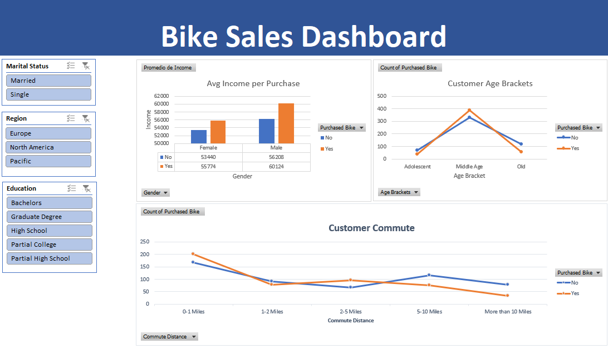

# Bike Sales Performance Dashboard (Excel Project)

## 📌 Project Description
This project consists of an end-to-end data analysis pipeline developed entirely within **Microsoft Excel**. The primary goal is to transform a "dirty" dataset containing demographic information of potential customers (`bike_buyers`) into an interactive dashboard that addresses key business questions and facilitates commercial decision-making.

The analysis identifies which specific factors (such as income, commute distance, age, or marital status) directly influence a customer's decision to purchase a bicycle.

---

## 🗺️ Project Phases

### 1. Data Cleaning and Preparation
To ensure data quality prior to analysis, the following steps were performed on a separate `Working Sheet`, preserving the raw source data intact:
* **Duplicate Removal:** Detection and elimination of repeated records based on the unique identifier (`ID`).
* **Variable Normalization:** Transforming abbreviations into human-readable terms using find-and-replace functionalities (e.g., `M` $\rightarrow$ `Married`, `S` $\rightarrow$ `Single`, `F` $\rightarrow$ `Female`, `M` $\rightarrow$ `Male`).
* **Formatting:** Setting financial columns (`Income`) to currency format without redundant decimals to improve visual readability.

### 2. Feature Engineering
* **Age Bucket Creation:** Since individual ages generated noisy and hard-to-interpret line charts, a nested logical `IF` function was implemented to segment users into three clear demographic categories:
    * **Adolescents:** Under 31 years old.
    * **Middle Age:** Between 31 and 54 years old.
    * **Old:** 55 years old or older.

### 3. Data Processing and Modeling
Using **Pivot Tables**, demographic variables were cross-referenced against the primary KPI (`Purchased Bike`):
* **Income Analysis:** Calculation of the average salary grouped by gender and purchase decision.
* **Logistics Analysis:** Customer count categorized by daily travel distance (`Commute Distance`).
* **Demographic Analysis:** Aggregation of purchases based on the newly created age brackets.

### 4. Visualization and Interactivity (Dashboard)
Designed a clean interface by removing traditional Excel gridlines and applying a cohesive corporate color palette:
* **Clustered Bar Chart:** Displays the relationship between average income and gender.
* **Line Chart:** Exposes purchase trends relative to commute distances.
* **Generational Trend Chart:** Easily identifies which demographic group represents the ideal customer.
* **Slicers:** Connected interactive filters for *Marital Status*, *Region*, and *Education* to all charts simultaneously, enabling custom data exploration.

---

## 📈 Key Business Insights
* **Purchasing Power:** Customers who ultimately buy a bicycle record, on average, higher salary incomes than those who choose not to.
* **Critical Age Bracket:** The "Middle Age" segment (31-54 years old) represents the most robust volume of buyers, while young adults under 31 show the lowest conversion interest.
* **Marital Status Effect:** Married customers register higher average incomes (between \$8,000 and \$10,000 additional) compared to single individuals within the dataset.

---

## 🛠️ Tools Used
* **Software:** Microsoft Excel
* **Core Functions:** Nested `IF` statements, Find and Replace, Custom cell formatting.
* **BI Components:** Pivot Tables, Pivot Charts, and Report Connections with Slicers.

---

## 📂 Repository Structure
* `/data`: Contains the original bike buyers dataset.
* `Bike_Sales_Project.xlsx`: Executable Excel file featuring the cleaned data, pivot tables, and the final interactive Dashboard.
* `README.md`: Detailed project documentation.
